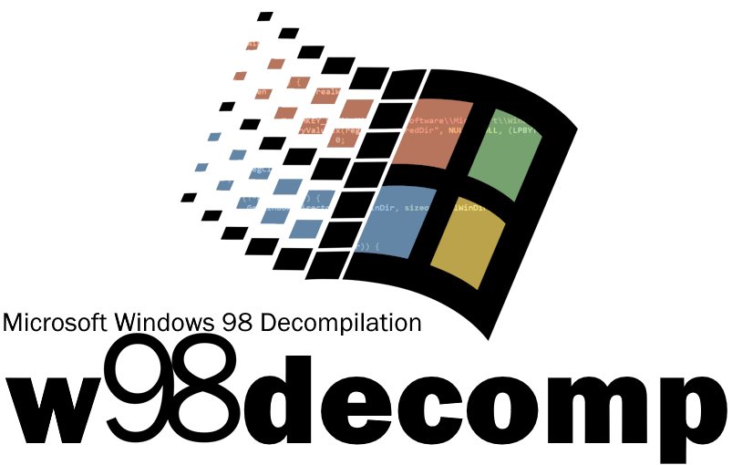

# Windows 98 Decompilation Project
A (W.I.P) decompilation of the Windows 98 operating system. Not all will be decompiled.
Windows 98 Second Edition is planned to be decompiled.

## There is currently no way to build the decompilation yet as this project just started...
But it does require an ISO of Windows 98!

## Progress
### CD-ROM
autorun.exe - 100% decompiled  
wb16off.exe - 100% disassembled (untested)

### System
welcome.exe - 2% decompiled (roughly)

