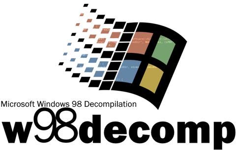

# Windows 98 Decompilation Project
A (W.I.P) decompilation of the Windows 98 operating system. I will try decompiling/disassembling as many things as I can.  
Windows 98 Second Edition is also going to be decompiled.

## There is currently no way to build the decompilation yet as this project just started...
But it does require an ISO of Windows 98!

## Fully decompiled apps (so far)
### CD-ROM
autorun.exe  
wb16off.exe (untested)  

### System 
pbrush.exe  
write.exe  

